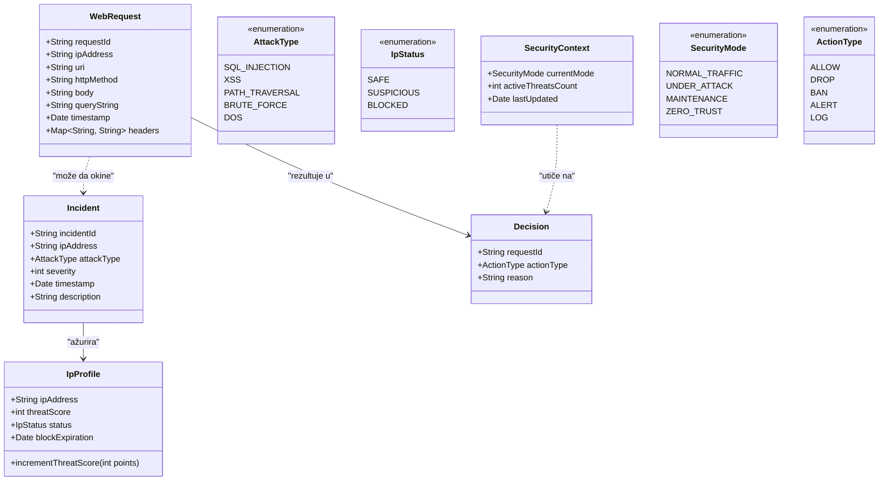

```mermaid
classDiagram
    class WebRequest {
        +String requestId
        +String ipAddress
        +String uri
        +String httpMethod
        +String body
        +String queryString
        +Date timestamp
        +Map~String, String~ headers
    }

    class AttackType {
        <<enumeration>>
        SQL_INJECTION
        XSS
        PATH_TRAVERSAL
        BRUTE_FORCE
        DOS
    }

    class Incident {
        +String incidentId
        +String ipAddress
        +AttackType attackType
        +int severity
        +Date timestamp
        +String description
    }

    class IpProfile {
        +String ipAddress
        +int threatScore
        +IpStatus status
        +Date blockExpiration
        +incrementThreatScore(int points)
    }

    class IpStatus {
        <<enumeration>>
        SAFE
        SUSPICIOUS
        BLOCKED
    }

    class SecurityContext {
        +SecurityMode currentMode
        +int activeThreatsCount
        +Date lastUpdated
    }

    class SecurityMode {
        <<enumeration>>
        NORMAL_TRAFFIC
        UNDER_ATTACK
        MAINTENANCE
        ZERO_TRUST
    }

    class Decision {
        +String requestId
        +ActionType actionType
        +String reason
    }

    class ActionType {
        <<enumeration>>
        ALLOW
        DROP
        BAN
        ALERT
        LOG
    }

    WebRequest --> Decision : "rezultuje u"
    WebRequest ..> Incident : "može da okine"
    Incident --> IpProfile : "ažurira"
    SecurityContext ..> Decision : "utiče na"
```
